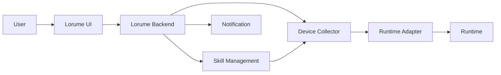

# Agent Migration And Bootstrap Spec

状态：当前规则

本规格定义 Lorume 帮助用户注册设备、识别 runtime、准备运行环境、复制 Agent 能力和安装 Skill 的产品边界。Agent 迁移不是单纯复制一个文件夹，也不是 Skill 管理的别名；它是围绕 Device、Runtime、Agent、Skill、Channel 和权限的一组可验证操作。

## 目标

- 引导用户把自己的设备注册到 Lorume，并持续上报设备、runtime、agent 和工作态。
- 在设备注册后识别可用 runtime，例如 OpenClaw、Codex、Multica、Slock、Claude Code。
- 帮助用户把一个已有 Agent 的可迁移配置安装到另一台设备 / runtime 上。
- 迁移过程只执行 runtime 官方 API / CLI、adapter、collector 安装脚本和确定性文件同步等已知 recipe。
- Skill 安装复用 Skill Management 的组织资产、分配、权限和同步规则。
- 对无法自动完成的步骤展示明确原因和手动补齐指引。
- 每次 bootstrap、runtime 安装、agent 创建、skill 同步都必须留下可排查的操作记录。

## 非目标

- 不通过 Agent 对话让 Agent 自行安装 Skill 或迁移自己。
- 不承诺所有设备都能零干预完成 runtime 安装。
- 不根据目标设备的复杂环境自动推断定制安装方案。
- 不把 SSH 作为产品连接方式。SSH 只允许作为开发测试时投递安装命令的辅助通道。
- 不在 Lorume 内提供聊天入口。
- 不接管 DingTalk、Telegram、Slack、Slock、Multica 等渠道的消息路由。
- 不引入长期可复用的迁移资产对象。
- 不为每个平台复制一套 UI 语义。平台差异必须由 adapter 能力声明和操作记录表达。

## 分层边界

### Device Bootstrap

Device Bootstrap 是把一台机器接入 Lorume 的过程。

职责：

- 安装或更新 Lorume Collector。
- 建立 outbound WebSocket 控制面。
- 上报设备身份、OS、arch、collector version 和最近错误。
- 探测本机 runtime、agent 和 channel 关联。

Device Bootstrap 不负责创建业务 Agent，不负责聊天，不负责外部平台账号登录。

### Runtime Setup

Runtime Setup 是在已注册设备上安装、识别或修复 runtime 的过程。

职责：

- 检测 runtime 是否存在。
- 检测 runtime 版本和健康状态。
- 检测 recipe 前置条件，例如 OS、arch、shell、node、npm、git、python、网络访问和必要 token。
- 在 adapter 提供安装 recipe 且前置条件满足时执行安装或升级。
- 返回安装日志、失败原因和手动补齐指引。

Runtime Setup 不能假设所有机器都有相同 shell、包管理器、权限或网络条件。前置条件不满足时必须停下，不自动猜测修复方案。

### Agent Migration

Agent Migration 是把一个 Agent 的可迁移配置复制到目标 runtime / device 的过程。

可迁移内容：

- Agent 名称、描述、运行 runtime kind。
- 可迁移配置，例如 model、reasoning effort、默认工作目录、runtime 支持的 agent metadata。
- Skill 分配关系。
- 目标 runtime 支持的 channel 关联摘要。

不可默认迁移内容：

- 外部平台私有 token。
- 用户登录态。
- 未授权的组织数据。
- 不支持导出的 runtime 私有状态。
- 历史会话和运行记录。
- 目标设备缺失依赖时的自动排障逻辑。

### Skill Installation

Skill Installation 由 Skill Management 负责。Agent Migration 只引用 Skill Assignment 和同步结果，不定义另一套 Skill 安装模型。

## 操作模型

Lorume 使用 Operation 记录过程，不引入长期可复用的迁移资产对象。系统只在用户发起一次迁移或安装时创建一次操作记录。

当前代码层有一个确定性的迁移计划模型 `src/migration/agent-migration-plan.ts`。它根据来源 Agent、目标设备在线状态、目标 runtime kind 和期望 Channel 生成当次计划，返回 `ready`、`unsupported` 或 `requires_manual_step`，用于在创建 Operation 前判断是否存在已知 recipe。这个计划不是持久化业务对象，也不是可复用模板。

Backend 通过 `POST /api/agent-migrations/plan` 暴露迁移计划能力。请求必须带 `organizationId`、`sourceAgentId`、`targetDeviceId`，可选 `targetRuntimeKind` 和 `desiredChannels`。Backend 从当前 Runtime Fleet 快照解析来源 Agent、来源 runtime、目标设备和目标 runtime，不接受前端传入的“目标在线 / runtime 已安装”等判断结果。

返回内容：

- `plan`：当前迁移计划，状态为 `ready`、`unsupported` 或 `requires_manual_step`。
- `sourceAgent` / `sourceRuntime`：来源对象摘要。
- `targetDevice` / `targetRuntime`：目标对象摘要；目标 runtime 未被 Collector 识别到时为 `null`。

规则：

- 目标设备不存在时返回 `target_device_not_found`。
- 来源 Agent 不存在时返回 `source_agent_not_found`。
- 目标设备未在线时返回 `requires_manual_step`，提示先让 Collector 建立连接并完成采集。
- 目标设备在线但没有识别到请求的 runtime 时返回 `requires_manual_step`，提示安装或启动该 runtime 并等待采集。
- 计划 API 只做确定性规划，不创建 Agent、不安装 runtime、不写 Skill、不伪造 Operation 成功。

### Agent Export Snapshot

Agent Export Snapshot 是来源 Agent 可迁移配置的只读快照。

字段：

- `sourceAgentId`：来源 Agent。
- `runtimeKind`：来源 runtime kind。
- `name` / `description`：可迁移展示信息。
- `runtimeConfig`：runtime adapter 明确允许导出的配置摘要。
- `skillIds`：来源 Agent 使用的组织 Skill。
- `channelSummary`：可展示渠道摘要。
- `unsupportedFields`：无法迁移的字段及原因。
- `snapshotHash`：快照 hash。

### Install Recipe

Install Recipe 是 adapter 明确声明的可执行步骤集合。

字段：

- `id`：recipe ID。
- `runtimeKind`：目标 runtime kind。
- `action`：`detect_runtime`、`install_runtime`、`create_agent`、`sync_skill`、`verify_agent`。
- `preconditions`：执行前置条件。
- `steps`：命令或 adapter 调用摘要。
- `rollback`：可回滚步骤，可为空。
- `limitations`：已知限制。

Recipe 必须由代码和 spec 明确维护，不能由用户输入任意 shell 命令。

### Operation

Operation 表示一次用户触发或系统触发的设备、runtime、agent 或 skill 操作。

字段：

- `id`：内部 ID。
- `organizationId`：所属组织。
- `type`：迁移相关操作统一使用 `agent_migration`。设备刷新、Skill 发布 / 分配 / 同步等其他异步动作使用各自模块在 [Operation And Job Runner Spec](./operation-job-runner-spec.md) 中定义的 Operation type。
- `requestedByUserId`：触发人。
- `targetDeviceId`：目标设备，可为空。
- `targetRuntimeId`：目标 runtime，可为空。
- `sourceAgentId`：来源 Agent，可为空。
- `targetAgentId`：目标 Agent，可为空。
- `exportSnapshotHash`：来源快照 hash，可为空。
- `status`：`queued`、`running`、`succeeded`、`failed`、`unsupported`、`requires_manual_step`、`cancelled`。
- `steps`：本次确认执行的步骤快照和状态。
- `errorSummary`：失败摘要，不包含密钥或完整原始日志。
- `manualInstruction`：需要用户手动补齐的说明，可为空。
- `createdAt` / `startedAt` / `finishedAt`：时间字段。

## 执行策略

迁移和安装按固定策略执行：

1. 读取来源 Agent，生成 Agent Export Snapshot。
2. 读取目标 Device / Runtime capability。
3. 校验用户对来源 Agent、目标 Device / Runtime 和相关 Skill 的权限。
4. 匹配 adapter 已知 Install Recipe。
5. 校验 recipe 前置条件。
6. 前置条件满足时创建 Operation 并执行。
7. 前置条件不满足时创建或返回 `requires_manual_step` Operation，并展示手动补齐指引。
8. Skill 相关步骤委托 Skill Management。
9. 执行完成或失败后产生通知事件。

系统只执行已知 recipe。没有 recipe、前置条件不满足、目标 runtime 不支持、缺少 token 或外部登录态时，不进入自动执行。

## 权限与审核

迁移涉及来源 Agent、目标 Device、目标 Runtime、Skill 和 Channel，因此权限必须拆开判断。

规则：

- 查看来源 Agent：需要来源 Agent 的 `view` 权限。
- 导出来源 Agent：需要来源 Agent 的管理权限。
- 在目标 Device 上安装 runtime：需要目标 Device 的 `manage_skills` 或设备管理权限。
- 在目标 Runtime 上创建 Agent：需要目标 Runtime 的管理权限。
- 把 Skill 同步到目标：遵循 Skill Management 的 Assignment 和审核规则。
- 迁移到非本人管理的 Agent 或共享 runtime，需要目标 owner 或组织 admin 审核。

审核使用 `approval_requests`，不单独创建迁移审核系统。

## Bootstrap 可行性

Device Bootstrap 的产品流程：

1. 用户在 Lorume 复制设备注册命令。
2. 用户在目标设备执行命令。
3. Collector 安装并连接 Lorume。
4. Collector 上报设备和 runtime 探测结果。
5. Lorume 展示已安装、可安装、不可安装或需要手动处理的 runtime。
6. 用户选择 runtime setup 动作。
7. Collector 只执行 adapter 已知 recipe。
8. Lorume 展示执行日志、健康状态、失败原因和下一步可操作项。

可行性约束：

- 没有 shell 执行权限时，只能提供手动指引。
- 缺少网络、git、node、python、包管理器或 runtime 官方安装脚本时，自动安装会停在前置条件检查。
- 需要用户登录外部平台或提供 token 的步骤不能静默完成。
- 安装脚本必须限定为 adapter 明确声明的 recipe，不能开放任意命令输入。
- 所有失败必须进入 Operation 记录，便于用户知道卡在哪一步。

## Runtime 能力矩阵

Adapter 必须声明以下能力：

- `detectRuntime`：识别 runtime 是否安装。
- `installRuntime`：安装 runtime。
- `updateRuntime`：更新 runtime。
- `createAgent`：创建 Agent。
- `exportAgent`：读取可迁移 Agent 配置。
- `importAgent`：在目标 runtime 创建等价 Agent。
- `configureChannel`：创建或恢复渠道关联。
- `syncSkill`：委托 Skill Management 同步 Skill。
- `verifyAgent`：校验目标 Agent 可识别并可用。

能力结果：

- `supported`
- `partial`
- `unsupported`
- `requires_manual_step`

### OpenClaw

- 支持 runtime 探测。
- 支持读取本地 Agent 和 Skill。
- Agent 创建、导出和导入优先通过 OpenClaw CLI / 本地配置能力实现。
- Skill 同步使用 OpenClaw adapter。
- Channel 关联只展示已识别的 DingTalk、Telegram、Slack 等渠道；不由迁移流程自动创建外部平台关联，除非 adapter 明确支持。

### Multica

- 支持 daemon、runtime 和 agent 探测。
- Agent 创建、导出和导入优先使用 Multica 自己的平台能力。
- Skill 同步使用 Multica Skill / agent 关联模型。
- Channel 由 Multica 自己的平台对象表达；Lorume 不把 Multica 当成 Channel。

### Slock

- 支持识别 Slock agent workspace 和 daemon 状态。
- Agent 迁移优先通过 Slock 可用 API / 本地 workspace 能力判断；没有稳定 API 时，只展示可迁移项和不可自动迁移原因。
- Skill 同步通过 Slock agent 背后的底层 runtime adapter 完成。
- 不直接修改 `.slock` 目录作为 Agent 迁移的默认策略。
- 不把 Slock 当成 Channel；Slock 是 runtime / platform source。

### Codex

- 支持 runtime 探测。
- 支持本地 Skill 目录同步。
- Agent 创建能力取决于当前 Codex 是否有稳定 agent 配置模型；没有时显示不支持自动创建 Agent。

## 通知

迁移、bootstrap、runtime setup、agent 创建和 skill 同步产生的通知由 [Notification Spec](./notification-spec.md) 统一管理。

迁移模块必须发出以下通知事件：

- Operation 需要审核。
- Operation 进入手动处理。
- Operation 成功。
- Operation 失败。
- Runtime setup 前置条件不满足。
- Skill 同步完成或失败。

通知事件只包含摘要、目标资源和跳转引用，不包含完整 shell 日志、密钥或外部平台私有返回体。

## 数据流

迁移数据流：

1. UI 选择来源 Agent 和目标 Device / Runtime。
2. Backend 读取来源 Agent、目标 capability、Skill assignment 和权限。
3. Backend 生成 Agent Export Snapshot，并匹配已知 recipe。
4. 用户确认可执行步骤，或看到不可自动化原因。
5. Backend 创建 Operation。
6. Collector 执行 runtime adapter 支持的步骤。
7. Skill 相关步骤委托 Skill Management。
8. Collector 上报结果。
9. Backend 更新 Operation 和目标 Agent 状态，并发出通知事件。

## UI 规则

Agent 迁移页面必须优先展示：

- 来源 Agent。
- 目标设备和 runtime。
- 目标 runtime 能力。
- 可迁移项。
- 不可迁移项和原因。
- recipe 前置条件。
- 需要审核的动作。
- 需要用户手动补齐的动作。
- 执行进度和失败日志摘要。

UI 不展示：

- 外部平台 token。
- 私有 API 原始返回。
- 完整 shell 日志中的密钥。
- “让 Agent 自己安装 / 自己迁移”的入口。

## Harness

Capability：

- `src/migration/agent-migration-plan.test.ts` 覆盖当前 runtime capability 和迁移计划状态。
- Adapter capability matrix 覆盖 OpenClaw、Multica、Slock、Codex 的 supported / partial / unsupported / requires_manual_step。
- Slock Skill 同步必须通过底层 runtime capability，不直接写 `.slock`。
- 无 runtime 的设备不能进入“让 Agent 自己安装”的路径，只能展示 bootstrap / runtime setup。
- 缺少 recipe 或前置条件不满足时，Operation 进入 `requires_manual_step`，不自动执行。

权限：

- 无来源 Agent 权限不能创建迁移 Operation。
- 无目标 Device / Runtime 权限不能执行安装或创建。
- 迁移到非本人目标时创建审核。
- Skill 同步遵循 Skill Management 审核。

Operation：

- 迁移异步动作使用 `agent_migration` Operation / Job，Job 进入 `requires_manual_step` 时 Operation 也进入 `requires_manual_step` 并保留 `manualInstruction`。
- 成功路径记录每一步状态。
- 失败路径记录 error summary 且不泄露密钥。
- 不支持能力返回 `unsupported`，UI 展示原因。
- 手动步骤返回 `requires_manual_step`，UI 展示明确指引。

UI：

- 迁移页面覆盖可迁移、不可迁移、需要审核、需要手动处理四类状态。
- 执行页覆盖 queued、running、succeeded、failed、unsupported、requires_manual_step。

## 验收标准

- 用户可以注册设备并看到可用 runtime 探测结果。
- 系统能基于来源 Agent 和目标 Runtime 创建一次可审计 Operation。
- 不支持自动化的步骤不会被伪装成可执行操作。
- Skill 安装只走 Skill Management 的 Assignment 与同步模型。
- 没有“让 Agent 自己安装 / 自己迁移”的入口。
- OpenClaw、Multica、Slock 的平台差异由 adapter capability 表达，UI 不直接拼接平台目录规则。
