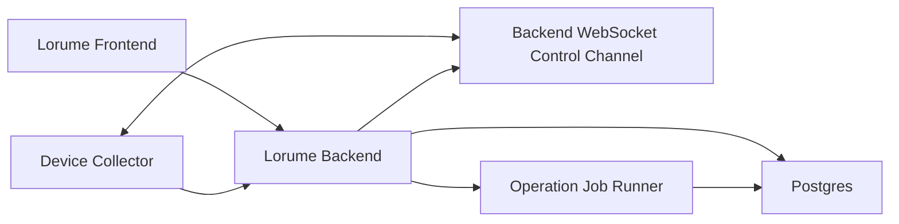

# Backend Service Spec

版本：TinySpec v0.4

Lorume backend 是独立于 Vite 的正式服务入口，用于承接登录与组织访问、collector 上报、Postgres 持久化、Runtime Fleet / Runs 查询、Skill 管理、异步 Operation / Job Runner、通知投递和设备控制面。当前阶段已经具备本地长期运行、production-like Docker / Nginx 验收形态，以及 `lorume.com` ECS 部署。

## 目标

- 提供独立于 Vite 的 Lorume backend 服务，前端和 collector 都通过 HTTP / WebSocket 访问它。
- 使用 Postgres 持久化设备、Runtime、Agent、Channel binding、工作项、会话、执行记录和采集记录。
- 保留设备侧主动连接后端的模型：collector 通过 outbound WebSocket 建立控制面，通过 HTTP POST 上报采集结果。
- 将 Runs / Runtime Fleet 的正式数据读取固定为“后端查询、前端展示”，不再使用前端拉 latest snapshot 后本地筛选作为正式路径。
- 每次 collector 上报都记录 ingestion 结果，并由后端生成设备采集健康结论，支持排查某个平台为什么缺数据、什么时候缺数据、缺了哪些能力。
- 使用 Postgres-backed Operation / Job Runner 承接 Skill、通知和后续迁移等异步动作。
- 提供 production-like 本地部署配置：后端 bundle、前端静态构建、Nginx 反代和 Postgres compose。
- 保持当前功能和测试质量，不为尚未上线的旧实现背兼容包袱。

## 非目标

- 不引入云数据库、复杂 secret manager 或完整审计系统。
- 本阶段不做中控 Agent、聊天入口、任务调度、消息代理或外部平台写操作。
- 本阶段不保留 file-backed latest JSON 作为正式后端路径；fixture 只允许作为开发期离线预览和测试辅助。
- 本阶段不拆微服务，不引入外部消息队列，不做跨机调度。

## 环境依赖

本地开发、harness 和 production-like 本地部署需要：

- Node.js 22.x。
- npm 10.x。
- Docker 27.x 或兼容版本。
- Docker Compose v2。
- Postgres 15 及以上。默认通过 Docker 容器运行，不要求本机安装 `psql`。

开发机可以通过 `npm run db:up` 启动 Postgres，通过 `npm run db:migrate` 应用 schema。Docker 镜像拉取失败属于环境问题，不改变代码路径或正式验收规则。

## 架构

边界：

- Frontend 只消费后端查询 API，不解释 OpenClaw、Multica、Slock 原始字段。
- Backend 负责 API、入库、查询、设备连接状态、刷新命令生命周期。
- Collector 负责只读采集和上报，不承担后端查询、用户权限或 UI 语义。
- Runtime adapter 仍负责把平台差异转换为 Lorume-owned semantics。

## 数据模型

第一版只保留必要表：

- `devices`：设备身份、hostname、OS、架构、collector 状态、最近同步和连接摘要。
- `runtimes`：设备上的 Runtime / 平台入口，例如 OpenClaw、Multica、Codex、Slock。
- `agents`：Lorume 管理视角下的 Managed Agent。
- `channel_bindings`：Agent 暴露给用户的触达渠道，例如 DingTalk、Telegram、Slack；Multica、Slock、OpenClaw、Codex 不作为 Runs 的 Channel。
- `work_items`：Agent 承接的业务工作项。
- `work_conversations`：会话、群组、线程或私聊上下文。
- `work_executions`：具体执行记录。
- `collector_ingestions`：每次 collector 上报的结果、数量、耗时、warning 和错误摘要。
- `operations`：用户可见的异步动作状态。
- `operation_jobs`：后端 runner 可 claim 和执行的任务单元。
- `notification_events` / `notification_threads` / `notification_deliveries` / `notification_preferences`：公共通知事件、聚合、投递和偏好。

暂不单独建 `device_connections`。WebSocket 在线状态可以保存在内存控制通道；可持久化的连接摘要先落在 `devices` 和 `collector_ingestions` 中。

## 上报与采集

Collector 保持主动上报：

- Inventory 快照可以全量上报，因为设备、Runtime、Agent 数量较小。
- Inventory 和 Work state 上报代表该设备的最新观测快照。后端按稳定 ID upsert 当前对象，并删除同一设备在新快照中已经消失的 Runtime、Agent、工作项、会话和执行记录；历史只保留在 `collector_ingestions` 中。
- Work state 里的 `workItemId`、`conversationId` 等可选关联必须以当前快照中真实存在的对象为准。缺失的可选关联写成 `NULL`，不能因为单个平台的关联证据不完整而拒绝整批工作态上报。
- Work state 里的 `runtimeId`、`agentId` 也必须按当前设备已注册对象校验。会话和工作项的陈旧 `runtimeId` / `agentId` 降级为 `NULL`；执行记录的 `runtimeId` 是必填外键，若 runtime 不存在则跳过该 execution，并在本次 ingestion 数量中反映实际写入数量。
- 每次上报必须写 `collector_ingestions`，记录设备、类型、状态、对象数量、warnings、错误摘要和接收时间。
- Collector 上报 inventory / work-state 时遇到网络错误或后端 `5xx` 可以做有限重试；`4xx` 代表 payload 或权限问题，不应通过重试掩盖。
- 设备 WebSocket 在线只表示控制面可达，不等于 inventory / work-state 采集健康。采集健康必须从 `collector_ingestions` 中最近一次 inventory 与 work-state 记录独立判断。
- 后续 collector 可演进为增量采集，但第一版可以先复用现有采集结果，由后端通过 upsert 去重。

建议节奏：

- `10-30s`：heartbeat / 连接状态。
- `30-60s`：work state 变化采集。
- `5-10min`：inventory 快照。
- 手动刷新或低频任务：全量 reconcile。

## API

保留现有 collector 上报入口和控制面入口：

- `GET /healthz`
- `GET /readyz`
- `POST /api/device-snapshots`
- `POST /api/runtime-work-state-snapshots`
- `WS /api/device-control/ws`
- `POST /api/devices/:deviceId/refresh`
- `GET /api/devices/:deviceId/commands/:commandId`

正式查询 API：

- `GET /api/runtime-fleet`
  - 参数：`search`、`runtimeKind`、`healthStatus`。
  - 返回 Runtime Fleet 页面需要的设备、Runtime、Agent、summary 和详情基础数据。
- `GET /api/runtime-work-items`
  - 参数：`search`、`source`、`channelKind`、`stage`、`startAt`、`endAt`、`limit`、`cursor`。
  - 后端负责筛选、时间范围、稳定 cursor 分页和排序，返回 `total` 与 `nextCursor`。
  - 返回行中的 `stage` 是后端已物化的 Lorume WorkStage；前端可以用它筛选和分栏，不能再按 `status` 覆盖成另一套阶段。
- `GET /api/runtime-work-items/:id`
  - 返回工作项详情。
- `GET /api/devices/:deviceId/ingestions`
  - 返回最近采集记录，用于解释数据新鲜度和缺口；记录必须包含 `observedAt` 和 `receivedAt`，方便区分设备观测时间与后端接收时间。
- `GET /api/devices/:deviceId/collection-health`
  - 返回设备级采集健康摘要和 inventory / work-state 两个检查项。
  - `healthy`：最近一次上报成功、未超时、无 warnings。
  - `warning`：最近一次上报成功，但 adapter 有 warnings，例如某平台部分 probe 不可用。
  - `stale`：最近一次上报超过健康阈值。
  - `failed`：最近一次上报失败。
  - `unknown`：尚未收到该 snapshot type 的采集记录。
  - 该接口面向产品诊断，不返回外部平台密钥、原始 payload 或调试-only 字段。
- `GET /api/operations`
  - 参数：`organizationId`、`status`、`resourceType`、`resourceId`、`targetType`、`targetId`、`limit`。
  - 需要当前用户属于该组织。
  - 返回用户可见的异步动作状态，供 Skill 发布、分配、同步、迁移和后续长耗时动作展示进度。
- `GET /api/operations/:operationId`
  - 需要当前用户属于该 Operation 所属组织。
  - 返回 Operation 和最近 Job 状态。
- `GET /api/notifications`
  - 参数：`organizationId`。
  - 需要当前用户属于该组织。
  - 返回当前用户可见的通知 Thread。
- `GET /api/notifications/:threadId`
  - 需要当前用户属于该 Thread 所属组织，且该 Thread 有当前用户的站内投递。
  - 返回 Thread 和 Delivery 详情。

前端缓存策略：

- 搜索输入 debounce。
- 筛选条件变化后请求后端。
- 前端保留当前结果、loading、empty、error 状态。
- 第一版不做复杂离线缓存；生产构建下后端不可用时展示明确错误，不回退 fixture。

## 部署形态

本地开发形态：

- Postgres 使用 `docker-compose.yml` 中的 `postgres` 服务。
- Backend 使用 `npm run dev:backend` 常驻运行。
- Frontend 使用 `npm run dev`，通过 Vite proxy 访问 backend。

Production-like 本地验收形态：

- `npm run build:backend` 使用 `vite.backend.config.ts` 生成 `dist/backend/backend-server.mjs`。
- `Dockerfile.backend` 构建 backend image，并在启动前执行 migration。
- `Dockerfile.frontend` 构建 Vite 静态前端，并通过 Nginx 提供静态资源。
- `nginx.lorume.conf` 反代 `/api`、`/healthz`、`/readyz` 和 WebSocket upgrade 到 backend。
- `docker-compose.prod-like.yml` 编排 Postgres、backend、frontend，用于 ECS 前的本地生产形态 smoke。

ECS 部署形态：

- 域名：`lorume.com`。
- 系统 Nginx 负责公网 `80/443`、HTTP 到 HTTPS 跳转、TLS 证书、静态前端反代、`/api`、`/healthz`、`/readyz` 和 WebSocket upgrade。
- Docker Compose 运行 Postgres、backend 和 frontend 容器；frontend 绑定 `127.0.0.1:8080`，backend 绑定 `127.0.0.1:4173`，Postgres 不暴露宿主端口。
- Nginx 必须配置足够的 `client_max_body_size`，当前为 `50m`，否则 collector 的 work-state 快照可能被 413 拒绝。
- 证书由 certbot 管理，`lorume.com` 当前使用独立证书；`/.well-known/acme-challenge/` 保留给续签。

后续以当前 ECS 形态为基线补齐生产鉴权、备份、监控和告警。

## Harness

后端正式化必须补齐以下检查：

- migration harness：迁移能在空 Postgres 上创建 schema，重复执行有可解释结果。
- repository harness：inventory / work-state snapshot 能 upsert 并查询。
- HTTP API harness：collector POST、runtime fleet query、work item query、ingestion query。
- readiness harness：`/healthz` 和 `/readyz` 能区分进程存活与数据库可用。
- control channel harness：WebSocket hello、heartbeat、refresh command lifecycle 继续可用。
- operation runner harness：Postgres Job claim、lease、retry、完成态和失败态。
- notification harness：事件聚合、限流、in-app 记录和 email delivery 记录。
- collector contract harness：现有 collector 上报 payload 仍可被后端接收。
- deploy config harness：backend bundle、Dockerfile、Nginx、production-like compose 必须和当前服务入口一致。
- production smoke harness：`npm run smoke:production` 检查 `/healthz`、`/readyz`、Runtime Fleet、Work Items 和设备采集健康查询。
- Playwright harness：Runtime Fleet 和 Runs 页面继续通过，且不依赖手动 dev 数据。
- `./scripts/verify.sh` 必须包含新增 backend 检查。
