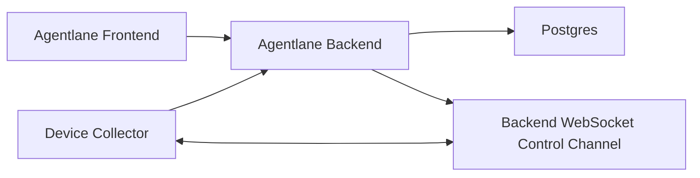

# Backend Service Spec

版本：TinySpec v0.1

Agentlane 需要把当前挂在 Vite dev server 上的本地调试 API，升级为可在本地长期运行、后续可部署到 ECS 的正式后端服务。本阶段只做本地闭环，不部署 ECS；本地 harness、代码 review 和人工验收通过后，再单独规划 ECS 部署。

## 目标

- 提供独立于 Vite 的 Agentlane backend 服务，前端和 collector 都通过 HTTP / WebSocket 访问它。
- 使用 Postgres 持久化设备、Runtime、Agent、Channel binding、工作项、会话、执行记录和采集记录。
- 保留设备侧主动连接后端的模型：collector 通过 outbound WebSocket 建立控制面，通过 HTTP POST 上报采集结果。
- 将 Runs / Runtime Fleet 的正式数据读取固定为“后端查询、前端展示”，不再使用前端拉 latest snapshot 后本地筛选作为正式路径。
- 每次 collector 上报都记录 ingestion 结果，支持排查某个平台为什么缺数据、什么时候缺数据、缺了哪些能力。
- 保持当前功能和测试质量，不为尚未上线的旧实现背兼容包袱。

## 非目标

- 本阶段不部署 ECS，不配置域名、HTTPS、云数据库或生产运维告警。
- 本阶段不引入用户、组织、多租户、RBAC、完整审计系统或复杂 secret manager。
- 本阶段不做中控 Agent、聊天入口、任务调度、消息代理或外部平台写操作。
- 本阶段不保留 file-backed latest JSON 作为正式后端路径；fixture 和测试辅助可以继续存在。
- 本阶段不拆微服务，不引入消息队列，不做跨机调度。

## 环境依赖

本地开发和 harness 需要：

- Node.js 22.x。
- npm 10.x。
- Docker 27.x 或兼容版本。
- Docker Compose v2。
- Postgres 15 及以上。第一版使用 Docker 容器即可，不要求本机安装 `psql`。

当前本机可用环境：

- Node.js `v22.22.1`。
- npm `10.9.4`。
- Docker `27.5.1`。
- Docker Compose `v2.32.4`。
- 本机没有 `psql` 命令，但可以用 `postgres:15-alpine` 容器中的 `psql`。

如果 Docker Hub 拉取失败，本地第一版允许使用已缓存的 `postgres:15-alpine`，backend 先通过本机 Node 运行；backend Docker image 可以等镜像源可用后补齐。

## 架构

边界：

- Frontend 只消费后端查询 API，不解释 OpenClaw、Multica、Slock 原始字段。
- Backend 负责 API、入库、查询、设备连接状态、刷新命令生命周期。
- Collector 负责只读采集和上报，不承担后端查询、用户权限或 UI 语义。
- Runtime adapter 仍负责把平台差异转换为 Agentlane-owned semantics。

## 数据模型

第一版只保留必要表：

- `devices`：设备身份、hostname、OS、架构、collector 状态、最近同步和连接摘要。
- `runtimes`：设备上的 Runtime / 平台入口，例如 OpenClaw、Multica、Codex、Slock。
- `agents`：Agentlane 管理视角下的 Managed Agent。
- `channel_bindings`：Agent 暴露给用户的触达渠道，例如 DingTalk、Telegram、Slack；Multica、Slock、OpenClaw、Codex 不作为 Runs 的 Channel。
- `work_items`：Agent 承接的业务工作项。
- `work_conversations`：会话、群组、线程或私聊上下文。
- `work_executions`：具体执行记录。
- `collector_ingestions`：每次 collector 上报的结果、数量、耗时、warning 和错误摘要。

暂不单独建 `device_connections`。WebSocket 在线状态可以保存在内存控制通道；可持久化的连接摘要先落在 `devices` 和 `collector_ingestions` 中。

## 上报与采集

Collector 保持主动上报：

- Inventory 快照可以全量上报，因为设备、Runtime、Agent 数量较小。
- Inventory 和 Work state 上报代表该设备的最新观测快照。后端按稳定 ID upsert 当前对象，并删除同一设备在新快照中已经消失的 Runtime、Agent、工作项、会话和执行记录；历史只保留在 `collector_ingestions` 中。
- Work state 里的 `workItemId`、`conversationId` 等可选关联必须以当前快照中真实存在的对象为准。缺失的可选关联写成 `NULL`，不能因为单个平台的关联证据不完整而拒绝整批工作态上报。
- 每次上报必须写 `collector_ingestions`，记录设备、类型、状态、对象数量、warnings、错误摘要和接收时间。
- 后续 collector 可演进为增量采集，但第一版可以先复用现有采集结果，由后端通过 upsert 去重。

建议节奏：

- `10-30s`：heartbeat / 连接状态。
- `30-60s`：work state 变化采集。
- `5-10min`：inventory 快照。
- 手动刷新或低频任务：全量 reconcile。

## API

保留现有 collector 上报入口和控制面入口：

- `POST /api/device-snapshots`
- `POST /api/runtime-work-state-snapshots`
- `WS /api/device-control/ws`
- `POST /api/devices/:deviceId/refresh`
- `GET /api/devices/:deviceId/commands/:commandId`

正式查询 API：

- `GET /api/runtime-fleet`
  - 参数：`search`、`runtimeKind`、`healthStatus`。
  - 返回 Runtime Fleet 页面需要的设备、Runtime、Agent、summary 和详情基础数据。
- `GET /api/runtime-work-items`
  - 参数：`search`、`source`、`channelKind`、`stage`、`startAt`、`endAt`、`limit`、`cursor`。
  - 后端负责筛选、时间范围、分页和排序。
- `GET /api/runtime-work-items/:id`
  - 返回工作项详情。
- `GET /api/devices/:deviceId/ingestions`
  - 返回最近采集记录，用于解释数据新鲜度和缺口。

前端缓存策略：

- 搜索输入 debounce。
- 筛选条件变化后请求后端。
- 前端保留当前结果、loading、empty、error 状态。
- 第一版不做复杂离线缓存。

## 部署形态

本地正式化阶段：

- Postgres 用 Docker Compose。
- Backend 可先用本机 Node 常驻运行。
- Frontend 使用 Vite dev server 或生产 build 预览。

通过本地 harness 和人工验收后，再规划 ECS：

- Nginx 提供静态前端并反代 `/api` 和 WebSocket。
- Backend 使用 Docker image。
- Postgres 可先用 compose volume，后续迁移 RDS。

## Harness

后端正式化必须补齐以下检查：

- migration harness：迁移能在空 Postgres 上创建 schema，重复执行有可解释结果。
- repository harness：inventory / work-state snapshot 能 upsert 并查询。
- HTTP API harness：collector POST、runtime fleet query、work item query、ingestion query。
- control channel harness：WebSocket hello、heartbeat、refresh command lifecycle 继续可用。
- collector contract harness：现有 collector 上报 payload 仍可被后端接收。
- Playwright harness：Runtime Fleet 和 Runs 页面继续通过，且不依赖手动 dev 数据。
- `./scripts/verify.sh` 必须包含新增 backend 检查。
