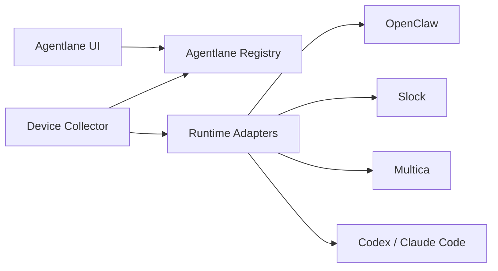

# Runtime & Device Registration Spec

版本：TinySpec v0.1

Agentlane v1 需要先把分散在多台设备、多个 runtime、多个外部平台上的 Agent 资产识别出来。这个阶段不做聊天入口，不做中控 Agent，不通过 Agentlane 接管消息路由，也不依赖 SSH 作为产品连接方式。

## 目标

- 通过一条本地安装命令在设备上安装 Agentlane Device Collector。
- Collector 以只读方式识别本机 runtime、agent、channel binding、负载摘要和健康状态。
- Collector 主动向 Agentlane 上报 snapshot；在没有服务端域名的开发期，可以本地路径安装并以 `--once` 输出 snapshot。
- Agentlane 统一消费标准化后的 Device、Runtime、ManagedAgent、ChannelBinding 对象。

## 非目标

- v1 不处理中控 Agent、附属 Agent 自动路由或跨平台消息分配。
- v1 不创建或编辑 Slock、Multica、OpenClaw 等外部平台里的 Agent。
- v1 不开放远程任意命令执行。
- SSH 只允许作为开发者把安装命令投递到远端设备的测试通道，不进入产品架构。
- 当前没有用户与权限模块，注册 token 只作为可选配置字段保留，不实现完整鉴权。

## 架构



## 对象边界

- Device：一台可注册设备，记录 hostname、OS、架构、collector、last seen 和健康状态。
- Runtime：设备上的可识别运行或平台入口。`kind` 用于表达 OpenClaw、Codex、Claude Code、Slock、Multica 等具象来源。
- ManagedAgent：Agentlane 管理视角下的 Agent。它可以来源于 OpenClaw 本机 Agent、Slock 平台 Agent、Multica 平台 Agent 或手动注册对象。
- ChannelBinding：Agent 被哪些渠道或外部平台暴露，例如 DingTalk、Slock、Multica。
- RuntimeSnapshot：Collector 单次采集结果，是 UI 和后续 Registry 写入的输入。

## Runtime Adapter

每个 adapter 只做只读采集，并返回统一的 adapter report。

- OpenClaw Adapter：读取 `openclaw health --json`、`openclaw status --json`、`openclaw tasks list --json`、`openclaw tasks audit --json` 的摘要。
- Slock Adapter：识别 `~/.slock/agents` 下的 agent workspace，以及本机 daemon/agent 进程摘要。v1 不调用私有 Web API 创建 Agent。
- Multica Adapter：读取 `multica daemon status --output json`、`multica runtime list --output json`、`multica agent list --output json`。
- Codex / Claude Adapter：识别 CLI 可用性、版本与基础 session 目录摘要。

## 安装方式

开发期没有域名时，安装脚本可以通过本地路径传到远端设备执行：

```sh
bash scripts/install-device-collector.sh \
  --source-dir /path/to/agentlane \
  --install-dir ~/.agentlane/collector \
  --device-id gezilinll-claw \
  --device-name gezilinll-claw \
  --once \
  --no-service
```

产品化后再切换为一条远程安装命令：

```sh
curl -fsSL https://agentlane.example/install.sh | bash -s -- \
  --server-url https://agentlane.example \
  --device-id <device-id>
```

## 验收

- 能通过 TypeScript harness 验证 adapter report 可以标准化成 Device、Runtime、ManagedAgent、ChannelBinding。
- 能通过脚本 harness 验证 collector 在 fixture 模式下输出 RuntimeSnapshot。
- 能通过安装脚本 harness 验证本地路径安装、配置写入、一次性采集运行。
- 能通过真实远端设备执行一次安装脚本，完成只读 snapshot 输出。
- `./scripts/verify.sh` 通过。
