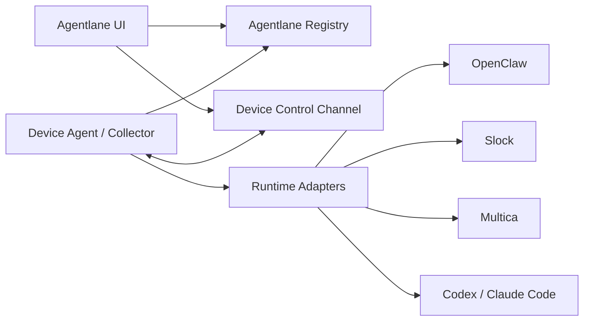

# Runtime & Device Registration Spec

版本：TinySpec v0.5

Agentlane v1 需要先把分散在多台设备、多个 runtime、多个外部平台上的 Agent 资产识别出来，并建立最小设备控制面。这个阶段不做聊天入口，不做中控 Agent，不通过 Agentlane 接管消息路由，也不依赖 SSH 作为产品连接方式。

## 目标

- 通过一条本地安装命令在设备上安装 Agentlane Device Collector。
- Collector 可以作为设备侧常驻 Device Agent 运行，设备主动连接 Agentlane。
- Collector 以只读方式识别本机 runtime、agent、channel binding、最近同步、Agent 工作负载统计和健康状态。
- Collector 主动向 Agentlane 上报 snapshot；在没有服务端域名的开发期，可以本地路径安装并以 `--once` 输出 snapshot。
- 本地开发后端接收 collector 上报，维护设备连接状态，并提供 Runtime Fleet / Runs 页面读取的正式查询 API。
- Agentlane 统一消费标准化后的 Device、Runtime、ManagedAgent、ChannelBinding、DeviceConnection 对象。
- WebSocket 控制面支持设备注册、心跳和远程刷新 snapshot。
- Collector 常驻模式必须周期性上报 inventory snapshot 和 work-state snapshot，不能只刷新资产清单。
- 为后续任务看板和 Agent 调度定义 WorkItem、Conversation、Execution 三层工作态模型，但 v1 Runtime Fleet 不直接接管调度。

## 非目标

- v1 不处理中控 Agent、附属 Agent 自动路由或跨平台消息分配。
- v1 不创建或编辑 Slock、Multica、OpenClaw 等外部平台里的 Agent。
- v1 不开放远程任意命令执行。
- v1 不把 WebSocket 用作聊天通道、任务调度通道或外部平台协议兼容层。
- v1 不采集和展示所有网卡、所有 MAC 地址或所有临时端口。
- SSH 只允许作为开发者把安装命令投递到远端设备的测试通道，不进入产品架构。
- 当前没有用户与权限模块，注册 token 只作为可选配置字段保留，不实现完整鉴权。

## 架构



## 对象边界

- Device：一台可注册设备，记录稳定 device id、展示名、hostname、OS、架构、collector、last seen 和健康状态。
- DeviceConnection：设备侧 Agentlane collector 与后端之间的连接状态，记录在线、失联、最后心跳、collector version 和最近错误。
- Runtime：设备上的可识别运行或平台入口。`kind` 用于表达 OpenClaw、Codex、Claude Code、Slock、Multica 等具象来源。
- ManagedAgent：Agentlane 管理视角下的 Agent。它可以来源于 OpenClaw 本机 Agent、Slock 平台 Agent、Multica 平台 Agent 或手动注册对象。
- ChannelBinding：Agent 被哪些用户触达渠道或外部入口暴露，例如 DingTalk、Telegram、Slack；Slock、Multica、OpenClaw、Codex 在 Runs 语义中属于 Runtime / 平台入口，不作为 Channel 筛选项。
- RuntimeSnapshot：Collector 单次采集结果，是 UI 和后续 Registry 写入的输入。
- Runtime endpoint 不作为 v1 的一等对象。Adapter 可以保留必要诊断字段，但 Runtime Fleet 页面不展示运行入口，除非后续出现明确管理动作。
- RuntimeWorkItem：业务工作项，例如 Slock board card、Multica issue、外部任务或需求卡片。
- RuntimeConversation：会话或线程，例如 channel thread、DM、OpenClaw session、Multica chat session。
- RuntimeExecution：一次具体运行，例如 OpenClaw run、Multica task/run、Slock agent activity。
- RuntimeObservationCapability：adapter 对 WorkItem、Conversation、Execution 三层数据满足度和采集策略的声明。

分层原则：

- Device 是连接和承载层，只回答设备是否在线、collector 是否连着、有哪些 Runtime 注册在这台设备上；Device 不拥有任务、会话或泳道。
- Runtime 是执行环境层，只回答执行环境是否可用、离线、闲置或工作中；Runtime 可以作为采集入口，但不拥有项目管理级任务或泳道。可用性与运行状态必须分开表达。
- ManagedAgent 是工作主体层，负责承接用户请求和任务；待处理、处理中、待验收、已关闭、需关注等项目管理级阶段只归 Agent。
- WorkItem、Conversation、Execution 是 Agent 工作态证据。它们可以通过 Runtime adapter 采集，但必须在 adapter / query 层关联回 ManagedAgent。
- OpenClaw CLI、Slock task board / activity、Multica issue / run 等都是采集策略，不是 Agentlane 产品语义。UI 只能消费 Agentlane 统一模型。

## 统一状态与统计语义

Adapter 必须把外部平台字段转换成 Agentlane 自己的统一模型，不能把 OpenClaw、Slock、Multica 的原始状态直接漏到 UI。

`lastSeenAt` 表示 Agentlane 最近一次从对象来源采集到该对象状态的时间。Device、Runtime、ManagedAgent 都使用同一语义。外部 `updated_at`、`last_seen_at`、snapshot observed time 等字段只能在 adapter 中转换为 `lastSeenAt`。

Runtime 运行状态：

- `offline`：Runtime 不可达或设备 / collector 失联。
- `working`：Runtime 可达，且关联 Agent 有 `processing` 工作项，或存在 `queued/running` execution。Slock v1 以 task board `in_progress` 作为工作中依据，不要求实时 activity。
- `idle`：Runtime 可达，adapter 能判断没有处理中工作项或运行中 execution。
- `unknown`：Runtime 可达，但当前 adapter 无法判断忙闲。

ManagedAgent 状态：

- `active`：当前有任务或会话正在执行。
- `idle`：当前无任务或会话执行，但 Agent 可识别且可用。
- `inactive`：已停用或不可接收任务。
- `degraded`：可识别但状态异常。
- `unknown`：adapter 无法判断当前状态。

Agent 工作负载统计：

- `activeTasks`：当前执行中的任务数。
- `queuedTasks`：当前排队任务数。
- `activeSessions`：当前活跃会话数。
- `historicalSessions`：历史或累计会话数。
- `maxConcurrency`：配置的并发容量。

这些统计属于 Agent 工作负载或诊断信息。Runtime 可以用它们汇总出粗粒度忙闲状态，但 Runtime 详情不展示任务/会话明细。Adapter 拿不到某个统计字段时不伪造数据，由 UI 展示为不支持采集。

## 识别与网络字段策略

Agentlane 只展示对识别设备、排查连接和理解 runtime 来源有用的字段。

- 设备身份：优先展示 Agentlane `deviceId` 和用户可读 `deviceName`，hostname 作为系统上报信息保留。
- 平台身份：可以记录 Slock machine/server 标识、Multica daemon id、OpenClaw gateway id 等平台标识。
- IP 地址：只保留主连接 IP 或后端观测到的公网出口 IP；不默认列出所有网卡地址。
- MAC 地址：默认不展示。确有设备识别需求时，只允许采集主网卡 MAC 并脱敏展示。
- 端口：只在有明确管理动作时作为 runtime 诊断字段保留，不作为 Device 的通用字段。设备侧采用 outbound 连接时，不要求开放入站端口。

## 本地开发 API

本地开发阶段使用独立 backend 服务承载最小 API 闭环；Vite 只负责前端开发并把 `/api` 代理到 backend：

- `POST /api/device-snapshots`：Collector 上报一次 `RuntimeInventorySnapshot`，服务端做最小结构校验并写入 Postgres 查询表。
- `GET /api/runtime-fleet`：Runtime Fleet 页面读取的正式查询 API。
- `POST /api/devices/:deviceId/refresh`：Runtime Fleet 请求后端通过控制面向在线设备下发 `inventory.refresh`。虽然命令名保持 v1 简化，设备侧执行时必须同时刷新 inventory snapshot 与 work-state snapshot。
- `GET /api/devices/:deviceId/commands/:commandId`：读取远程刷新命令状态。
- `WS /api/device-control/ws`：设备侧 collector 建立 outbound WebSocket，用于 `hello`、`heartbeat`、`inventory.refresh`、`command.result`。
- `POST /api/runtime-work-state-snapshots`：Collector 上报一次 `RuntimeWorkStateSnapshot`，服务端做最小结构校验并写入 Postgres 查询表。
- `GET /api/runtime-work-items`：Runs / Work Board 页面读取的正式查询 API。
- `GET /api/devices/:deviceId/ingestions`：读取设备最近采集记录，用于解释数据新鲜度和缺口。

`runtime-inventory-store` 和 `runtime-work-state-store` 仍可作为内部校验、控制面命令状态和测试辅助使用，但不暴露 latest GET API，也不是 Runtime Fleet / Runs 的正式读取路径。

## WebSocket 控制面

WebSocket 是设备控制面，不是聊天入口。设备永远主动连接 Agentlane，避免要求内网设备暴露公网入口。

消息 envelope：

- `hello`：设备连接后声明 `deviceId`、`deviceName`、collector version 和 hostname。
- `hello.ack`：后端确认连接已登记。
- `heartbeat`：设备周期性上报 collector 状态、负载摘要和最近错误。
- `inventory.refresh`：后端向设备下发刷新 snapshot 命令。设备侧必须做只读采集，并依次上报 inventory snapshot 与 work-state snapshot；命令结果需要返回 inventory `observedAt` 和 `workStateObservedAt`。
- `command.accepted`：设备确认收到命令。
- `command.result`：设备回传命令执行结果。
- `error`：任何一方回传可解释错误。

命令必须包含 `commandId`。设备侧需要按 `commandId` 做幂等保护，避免同一刷新命令重复执行危险动作。v1 的唯一远程命令是 `inventory.refresh`，只允许触发只读采集。

连接状态分层：

- Device connection：Agentlane device agent 是否在线。
- Runtime health：OpenClaw、Codex、Multica、Slock 等 runtime 是否可用。
- Agent availability：某个 managed agent 是否可接收任务或可见。
- Channel binding：DingTalk、Telegram、Slack 等触达渠道或外部入口绑定是否存在且启用；Runs 页面只把用户触达渠道作为 Channel 筛选项。

## Runtime Adapter

每个 adapter 只做只读采集，并返回统一的 adapter report。

- OpenClaw Adapter：读取 `openclaw health --json`、`openclaw status --json`、`openclaw tasks list --json`、`openclaw tasks audit --json` 的摘要。OpenClaw 命令常见为 Node shim，collector 必须用增强后的 probe `PATH` 启动子进程，让 shim 能找到同目录或 Node 安装目录中的解释器。OpenClaw 命令输出可能超过 Node 默认同步子进程 buffer，collector 必须使用受控的大 buffer 读取 JSON，不能把大输出截断误判为不可用。
- Slock Adapter：识别 `~/.slock/agents` 下的 agent workspace，以及本机 daemon/agent 进程摘要。v1 不调用私有 Web API 创建 Agent。task-board internal API 出现临时 5xx、网络抖动或超时时，collector 应做小次数重试；重试成功不记录 channel probe warning。同一个 channel 被多个本地 Slock agent context 探测时，只要任一 context 成功采到该 channel，就不记录该 channel 的失败 warning。
- Multica Adapter：读取 `multica daemon status --output json`、`multica runtime list --output json`、`multica agent list --output json`。
- Codex / Claude Adapter：识别 CLI 可用性、版本与基础 session 目录摘要。

当前转换规则：

- OpenClaw `sessionsCount` / `totalSessions` 映射为 `historicalSessions`，不能映射为 `activeSessions`。没有当前执行证据时 Agent 状态为 `idle`。
- Multica agent `status` 按 Agentlane 状态枚举转换，`max_concurrent_tasks` 映射为 `maxConcurrency`，`updated_at` / `last_seen_at` 映射为 `lastSeenAt`。
- Slock 本地 workspace 只能证明 Agent 被识别，不能证明正在执行；没有 task board 或其他工作态证据时 Agent 状态为 `unknown`。当 Slock task board 已可观测时，assignee + `in_progress` 可把对应 Agent 展示为 `active`，没有处理中任务的已识别 Agent 可展示为 `idle`。Collector 默认使用 `https://api.slock.ai` 加本地 agent token 做只读 task-board 探测；自托管或测试环境可通过 `slockServerUrl` / `SLOCK_SERVER_URL` 覆盖。

## 工作态模型

Agentlane 把业务任务、会话线程和真实运行执行分开建模。TypeScript source of truth 是 `src/runtime/runtime-work-state.ts`，当前平台探测和满足度记录在 [runtime-work-state-probe.md](./runtime-work-state-probe.md)。

- `RuntimeWorkItem.status` 表达业务生命周期，例如 `todo`、`in_progress`、`in_review`、`done`、`blocked`、`cancelled`、`unknown`。
- `RuntimeConversation.status` 表达会话生命周期，例如 `open`、`active`、`idle`、`closed`、`unknown`。
- `RuntimeExecution.status` 表达运行生命周期，例如 `queued`、`running`、`succeeded`、`failed`、`cancelled`、`unknown`。
- `RuntimeWorkStage` 表达统一管理阶段，例如 `pending`、`processing`、`review`、`closed`、`attention`。

约束：

- 看板中的 `in_progress` 不等于真实 execution running，不能直接映射为 `RuntimeExecution.status=running`；但它可以作为 Agent 正在承接工作和 Runtime 粗粒度 `working` 的业务证据。
- 平台的在线状态不等于执行态。比如 Slock server info 的 agent `active` 只能证明可用或在线，不能证明正在工作。
- 平台没有的阶段不能伪造。比如 OpenClaw 没有 review 概念，成功 execution 直接进入 `closed`，失败、取消或未知进入 `attention`；OpenClaw 的 `pending` 必须来自上游 WorkItem。
- 同一个 WorkStage 必须带 `confidence`，区分直接证据、部分推断和平台不支持。
- Adapter 可以使用不同策略采集不同平台，例如 CLI、native API、local state、process、network proxy 或 managed launcher，但必须在 adapter 内转换成 Agentlane-owned semantics。
- Adapter 拿不到的字段不伪造，由能力声明和 UI 展示为不支持、部分支持或未知。

## 安装方式

开发期没有域名时，安装脚本可以通过本地路径传到远端设备执行：

```sh
bash scripts/install-device-collector.sh \
  --source-dir /path/to/agentlane \
  --install-dir ~/.agentlane/collector \
  --device-id gezilinll-claw \
  --device-name gezilinll-claw \
  --server-url http://127.0.0.1:4173 \
  --slock-server-url https://api.slock.ai \
  --once \
  --no-service
```

服务模式用于真实设备注册和持续连接：

```sh
bash scripts/install-device-collector.sh \
  --source-dir /path/to/agentlane \
  --install-dir ~/.agentlane/collector \
  --device-id gezilinll-claw \
  --device-name gezilinll-claw \
  --server-url http://agentlane.local \
  --slock-server-url https://api.slock.ai
```

产品化后再切换为一条远程安装命令：

```sh
curl -fsSL https://agentlane.example/install.sh | bash -s -- \
  --server-url https://agentlane.example \
  --device-id <device-id>
```

## 验收

- 能通过 TypeScript harness 验证 adapter report 可以标准化成 Device、Runtime、ManagedAgent、ChannelBinding。
- 能通过脚本 harness 验证 collector 在 fixture 模式下输出 RuntimeSnapshot。
- 能通过脚本 harness 验证 collector 可把 RuntimeSnapshot POST 到 Agentlane 后端。
- 能通过后端 harness 验证 collector POST 写入、查询 API、最小结构校验和不暴露 legacy latest GET API。
- 能通过后端 harness 验证 device WebSocket 连接、heartbeat、断连和远程刷新命令生命周期。
- 能通过 collector harness 验证 daemon 启动和远程刷新命令都会同时上报 inventory snapshot 与 work-state snapshot。
- 能通过安装脚本 harness 验证本地路径安装、配置写入、一次性采集运行。
- 能通过 Runtime harness 验证 adapter 把平台字段转换成 Agentlane 状态、`lastSeenAt` 和 Agent 工作负载统计语义。
- 能通过前端 harness 验证刷新按钮向后端请求远程刷新，并展示成功或失败状态。
- 能通过前端 harness 验证刷新按钮不会把 `accepted` 当作终态，而是轮询到远程刷新命令 `succeeded` 后再展示完成。
- 能通过前端 harness 验证页面自动读取后端查询 API，且不展示原始 UTC ISO 时间。
- 能通过 Runs / Work Board harness 验证页面只消费统一 WorkStage / confidence，不直接解释平台原始状态。
- 能通过 Runs / Work Board harness 验证 Slock `in_progress` 显示为 `processing + partial`，OpenClaw 成功 execution 直接进入 closed，失败 execution 进入 attention。
- 能通过 collector harness 验证 OpenClaw Node shim 在 launchd / ssh 的最小 `PATH` 下仍可运行、OpenClaw 大 JSON 输出不会被截断成不可用，Slock task-board transient failure 会重试并在成功后不产生误报 warning，同 channel 被其他 context 成功采集时不产生误报 warning。
- 能通过真实远端设备执行一次安装脚本，完成只读 snapshot 输出。
- `./scripts/verify.sh` 通过。
