# Lorume Product Design

版本：Product Concept v0.1

Lorume 是面向生产环境的 Agent Network 控制平面，用来管理人、Agent、Workflow、Skill、多设备 Worker、Run、Memory、Policy 与 Governance。它的目标不是提供一个新的聊天入口，而是把分散在个人电脑、远端机器、cron、skill、脚本、对话入口和人工经验里的 Agentic Work，收敛成可以被观察、调度、治理和演进的产品系统。

## 设计原则

- 产品形态是生产级 AgentOps Console，不是聊天产品，也不是单 Agent 框架。
- Skill 是一等对象，必须能查看、编辑、测试、发布、同步到 Worker、回滚和下线。
- Agent、Workflow、Skill、Worker、Run、Policy、Registry、Governance 都应有明确 owner、权限、生命周期和审计记录。
- Semantic Coordinator 负责语义路由、拆解、跨域协调和升级；Runtime / Execution Fabric 负责队列、Worker 调度、并发、重试、健康检查和故障切换。
- 页面图用于表达产品界面方向；交互、对象边界和实现依据以本文档为准。

## 视觉语言

Lorume 的长期 UI 方向是 **Cream Arcade**：像素风、极客工具感和克制游戏感。它服务于“团队操作台”的产品定位，不应该把 Console 做成营销页或玩具界面。

视觉规范、设计 token、组件规则、页面模式和自验要求以 [design/README.md](design/README.md) 为准。本文档只保留产品对象、信息架构、用户动线和页面职责。

## 产品对象模型

Agent Network 是一套面向团队与业务工作的智能工作网络。它的目标不是简单堆叠多个 Agent，而是让关键工作变得可委托、可观测、可复用、可治理、可持续演进。

### Workflow 与 Domain Agent

Workflow 代表可重复执行的业务流程，具备固定触发、固定步骤、固定产物、固定接收人。典型对象包括经营节奏、成本效率、质量稳定、交付闭环、用户市场和个人工作流。

Domain Agent 代表领域判断主体，沉淀领域口径、归因、解释和建议。典型对象包括 Business Metrics Agent、Cost Agent、AI Tool Efficiency Agent、Quality Agent、Delivery Agent、User Insight Agent、Competitive Intelligence Agent。

每个正式 Workflow 和每个正式 Domain Agent 都必须有 owner 槽位。owner 可以暂定 TBD，但责任位不能缺失。

Agent 和 Workflow 不是单向关系，而是受治理的互相调用关系。Workflow 可以调用 Domain Agent 获取领域判断；Personal Work Agent 可以触发 Workflow；Domain Agent 在发现后续动作需要流程化处理时，也可以触发 Workflow；Semantic Coordinator 可以按需调用多个 Agent 或 Workflow。边界必须保持清晰：Agent 负责判断，Workflow 负责可重复流程。二者可以互相调用，但不能互相吞并。

### Personal Work Agent

Personal Work Agent 是每个人的工作入口实例，不是某个岗位 Agent 的简单复制。

它由个人入口实例、Role Profile、Responsibility Tags、Preference Memory、Permission Policy 共同组成。PM、Engineer、QA 是 Role Profile；Cost Owner、Quality Owner、Metric Owner 是 Responsibility Tag。它们不是独立 Agent。

Personal Work Agent 本身不拥有领域真相，而是带着个人上下文、权限和偏好，调用 Domain Agent、Workflow、Tool 和数据源。

### Semantic Coordinator

Semantic Coordinator 是语义编排对象，负责处理模糊、跨域、需要拆解或升级的任务。

它负责判断请求应该交给谁、是否需要拆成多个子任务、是否涉及多个领域、是否需要升级给人。它不负责机器调度、并发控制、失败重试或多机分配，这些属于 Runtime / Execution Fabric。

### Runtime / Execution Fabric

Runtime / Execution Fabric 是运行与分布式执行基础设施，负责把任务稳定执行起来。

它处理 Task Queue、Multi-machine Dispatch、Concurrency、Retry、Health Check、Capacity、Session Routing、Failover。它回答的是“跑在哪、怎么跑稳”，不是“这个请求语义上该找谁”。

### Shared Infrastructure

Shared Infrastructure 是 Agent Network 的共享底座，包括 Tools、Data & Knowledge、Memory、Policy。

Tools 负责执行动作；Data & Knowledge 提供事实和口径；Memory 保存角色、偏好、决策和项目上下文；Policy 约束权限、审批、预算、外发和自动化边界。

### Governance

Governance 是横切治理，不是事后补丁。它覆盖 Workflow、Domain Agent、Runtime、Shared Infrastructure 和 Outputs。治理对象包括 Eval、Permission、Audit、Stability、Security、Cost Guard、Memory Governance。

治理发生在执行前、执行中和执行后：执行前检查权限和边界，执行中检查稳定性和成本，执行后检查质量、审计、追溯和记忆写入。

### Registry / Catalog

Registry / Catalog 是对象目录和元数据系统，不参与运行时执行。它记录 Workflow、Agent、Runtime、Tool、Data Source、Memory、Policy、Eval、Profile / Responsibility 等对象的 owner 槽位、权限、输入输出、评测方式和生命周期。

### Lifecycle

每个正式对象都应该经过 Draft、Review、Pilot、Production、Monitor、Retire / Replace。每个对象都必须可评测、可审计、可回退、可下线。

## 信息架构

Lorume 当前采用桌面 Web Console。当前可操作导航只暴露已经落地并可验收的页面：

- Runtime Fleet
- Skill 管理
- Runs / Work Board
- 任务中心
- 通知中心
- 组织设置

未实现模块可以保留在产品规划里，但在对应页面、数据链路、权限和 harness 没有落地前，不进入主导航、首页 CTA 或用户可点击入口。避免把未实现能力包装成可用功能。

身份与访问：

- `/` 是公开主页，用来解释 Lorume 的控制面定位和当前已接入能力。
- `/login` 是邮箱验证码登录入口。
- `/invite/:token` 是组织邀请入口，用户登录被邀请邮箱后加入组织。
- `/runtime`、`/skills`、`/runs`、`/operations`、`/notifications`、`/settings` 是当前 Console 深链路由，未登录时需要先完成登录。
- 未登录用户进入邮箱验证码登录。
- 登录后如果没有组织，需要创建组织或通过邀请链接加入组织。
- 成员、角色、邀请和设备 token 管理由组织设置、auth 后端和设备 token 后端能力承载；正式 People & Access 页面在实现前不出现在导航。
- Device Collector、Runtime Fleet、Runs 等生产数据都应归属到组织边界内。

当前主要用户动线：

- 管理运行资产：登录 -> Runtime Fleet -> 查看 Device、Runtime、Agent、采集健康和刷新结果。
- 查看 Agent 工作项：登录 -> Runs / Work Board -> 按 Runtime、Channel、阶段和时间范围查看工作项。
- 管理 Skill：登录 -> Skill 管理 -> 导入、提升、编辑、发布、审核、分配、查看目标 Skill Set 和同步 Skill。
- 跟踪异步任务：登录 -> 任务中心 -> 查看 Operation / Job 状态、失败原因和目标资源。
- 查看通知：登录 -> 通知中心 -> 查看同步、采集、审核和恢复类通知。
- 管理组织：登录 -> 组织设置 -> 查看当前组织与成员身份，创建邀请链接。

长期用户动线：

- 运营者：Command Center -> Runs / Run Trace -> Worker Fleet / Governance Center
- Agent/Workflow 创建者：Object Catalog -> Agent Studio / Workflow Studio / Skill 管理 -> Dry Run -> Publish -> Runs
- 平台管理员：组织设置 / People & Access -> Integrations & Resources -> Worker Fleet -> Governance Center

## 运行态术语

- Run：一次端到端执行实例，包含 route plan、tasks、logs、outputs、approvals 和 audit records。
- Task：Runtime Fabric 可调度的执行单元，可以等待 Worker、等待并发槽位，或被 Worker 执行。
- Active Runs：尚未 completed、failed、cancelled 或 archived 的 Run，包括 running、queued、waiting approval、retrying 等状态。
- Queue Depth：Task Queue 中尚未被 Worker pick up 的排队 Task 数，不包含正在执行的 in-flight tasks，也不包含未来定时但尚未入队的 scheduled tasks。

一个 Run 可以包含多个 Task。例如一次 AI+ 转化率分析 Run，可能拆成链接解析、BI 查询、星图查询、报告生成和钉钉发送多个 Task。

## 01. 总控台 Command Center

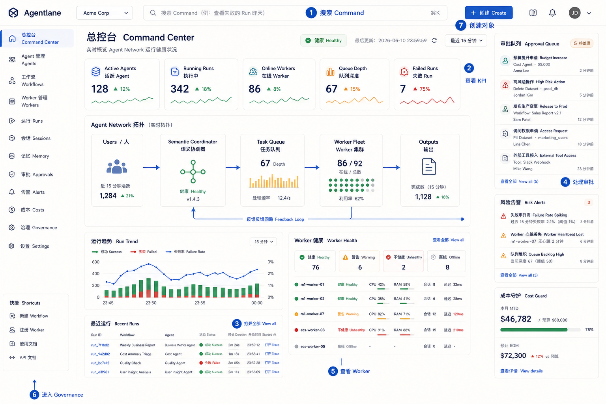

Purpose:
查看 Agent Network 当前是否健康，包括活跃 Agent、运行中的 Run、在线 Worker、队列深度、失败任务、审批和治理风险。

Primary users:
平台运营者、OpenClaw 运维者、团队负责人。

Key interactions:

- 使用全局 Command 搜索对象、Run、Worker 或治理事件。
- 点击 KPI 卡片下钻到 Runs、Worker Fleet 或 Governance。
- 从拓扑图查看 Users -> Semantic Coordinator -> Task Queue -> Worker Fleet -> Outputs 的运行链路。
- 在右侧处理待审批任务或打开风险告警。
- 快速创建 Agent、Workflow、Skill 或注册 Worker。

Data objects:
Agent、Workflow、Skill、Worker、Run、Task Queue、Approval、Alert、Policy、Audit Log。

Entry points:
登录后默认首页、告警邮件/钉钉通知、Run Trace 返回入口。

Exit points:
Run Trace、Worker Fleet、Governance Center、Catalog、Workflow Studio。

## 02. 对象目录 Catalog

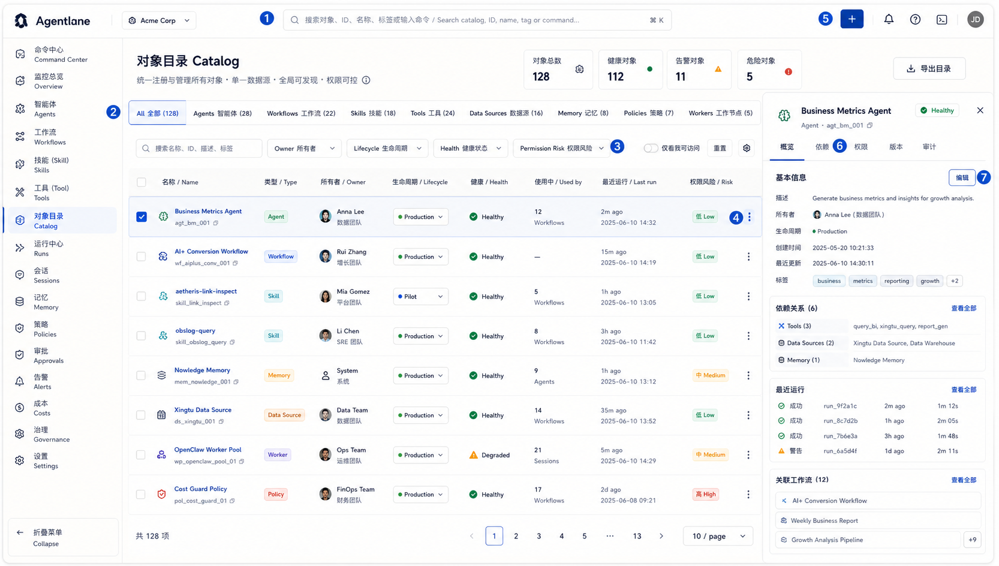

Purpose:
作为所有正式对象的统一 Registry，集中查看 Agent、Workflow、Skill、Tool、Data Source、Memory、Policy、Worker 的 owner、生命周期、健康状态和依赖关系。

Current boundary:
对象目录是产品对象模型方向，不是当前 Console 导航中的已实现页面。重新进入实现前必须补齐真实数据链路、权限边界和对应 harness，避免用静态种子数据替代用户可验收能力。

Primary users:
Agent/Workflow 创建者、平台管理员、治理负责人。

Key interactions:

- 按对象类型、owner、lifecycle、health、permission risk 过滤。
- 搜索已有对象，例如 `aetheris-link-inspect`、`AI+ Conversion Workflow`、`OpenClaw Worker Pool`。
- 打开右侧详情抽屉查看依赖、最近 Runs、使用方和风险。
- 从目录直接创建 Agent、Workflow、Skill 或注册资源。
- 进入对应 Studio 或 Editor 做编辑和发布。

Data objects:
CatalogObject、Agent、Workflow、Skill、Tool、Data Source、Memory、Policy、Worker、Dependency、Lifecycle。

Entry points:
Command Center、全局 Command、Governance 告警、Run Trace 依赖跳转。

Exit points:
Agent Studio、Workflow Studio、Skill 管理、Integrations & Resources、Governance Center。

## 03. Agent Studio

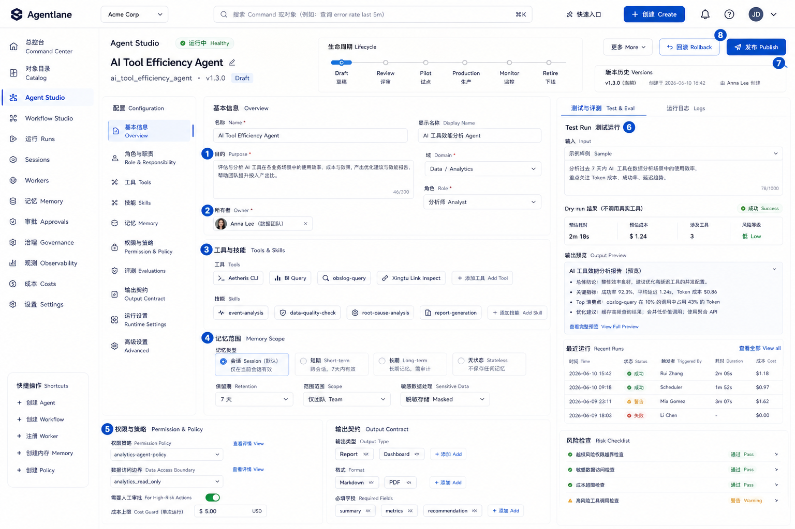

Purpose:
创建和维护 Domain Agent。Agent 负责领域判断、归因、解释和建议，不直接替代 Workflow 或 Skill。

Primary users:
领域 owner、平台管理员、Agent 维护者。

Key interactions:

- 编辑 Agent 的 Purpose、Domain、Role 和 Output Contract。
- 分配 Owner 和 Responsibility Tags。
- 绑定 Skills / Tools，例如 Aetheris CLI、event-analysis、obslog-query、BI Query、Xingtu Link Inspect。
- 设置 Memory Scope 和 Permission Policy。
- 配置 Eval Checklist，并执行 Test Run。
- 从 Draft 推进到 Review、Pilot、Production、Monitor。
- 发布新版本或回滚到历史版本。

Data objects:
Agent、Owner、ResponsibilityTag、SkillAssignment、ToolBinding、MemoryScope、PermissionPolicy、Eval、Version、Run。

Entry points:
Catalog、Create Agent Flow、Governance 缺失 owner 告警。

Exit points:
Runs / Run Trace、Catalog、Governance Center、Skill 管理。

## 04. Workflow Studio

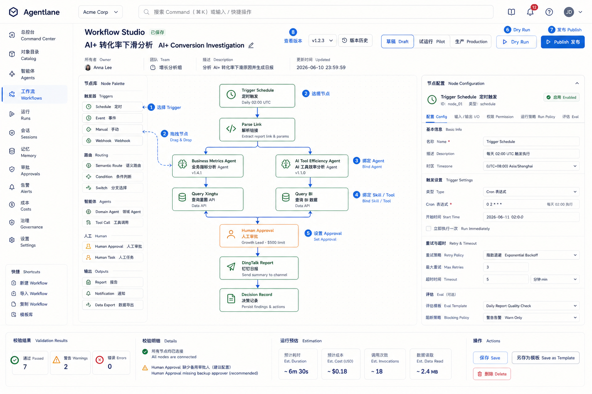

Purpose:
编排可重复运行的固定 Workflow，明确触发、步骤、调用对象、审批、产物、接收人和生命周期。

Primary users:
业务流程 owner、运营者、平台管理员。

Key interactions:

- 选择 Trigger，例如 Schedule、Event、Webhook、Manual、DingTalk。
- 拖拽或新增步骤节点。
- 绑定 Domain Agent、Skill 和 Tool。
- 设置 Human Approval、Output、接收人、timeout、retry 和 eval。
- 执行 Dry Run 验证输入输出。
- 发布到 Pilot 或 Production，并保留 Version。
- 从 Run Trace 回看每个节点执行情况。

Data objects:
Workflow、Trigger、Step、AgentCall、SkillAssignment、ToolCall、Approval、Output、Schedule、Version、Run。

Entry points:
Catalog、Create Workflow Flow、Command Center 快捷创建。

Exit points:
Runs / Run Trace、Governance Center、Agent Studio、Skill 管理。

## 05. Skill 管理

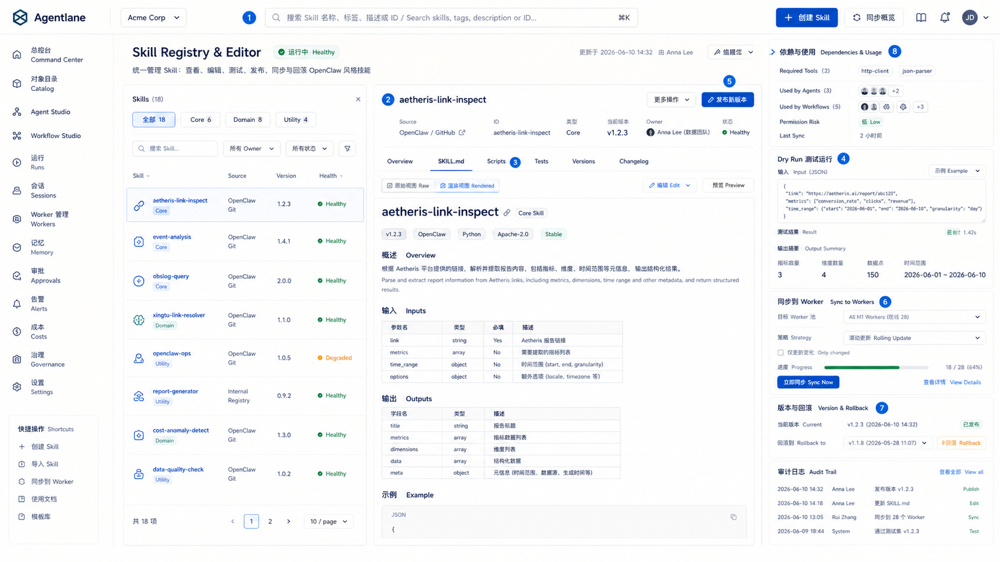

Purpose:
把 Skill 作为组织级一等资产管理，支持导入、查看、校验、发布、审核、分配到 Device / Runtime / Agent，并观察相关异步操作与通知。详细规则以 [Skill Management Spec](./skill-management-spec.md) 为准。

Primary users:
Skill 维护者、OpenClaw 运维者、Agent/Workflow 创建者。

Key interactions:

- 查看 Skill metadata：source、version、owner、validation、operations、notifications。
- 打开版本、文件树、校验结果、权限动作和目标分配。
- 导入 Markdown、GitHub URL 或 Marketplace 来源；ZIP 由后端统一包校验支持，页面没有上传控件时不展示 ZIP 入口。
- 发布最新版本或提交发布审核。
- 选择 Device、Runtime 或 Agent 作为目标并创建分配 Operation 或分配审核。
- 查看相关 Operation、审批和页面内通知。
- 不展示没有 API 与 harness 覆盖的编辑、归档、删除、手动同步或目标能力探测入口。

Data objects:
Skill、SkillVersion、SkillFile、SkillAssignment、ResourcePermission、ApprovalRequest、Operation、NotificationThread。

Entry points:
Catalog、Agent Studio Skill Assignment、Workflow Studio Skill Assignment、Governance 风险告警。

Exit points:
Runtime Fleet、Runs / Work Board、Governance Center、Catalog。

## 06. Worker Fleet

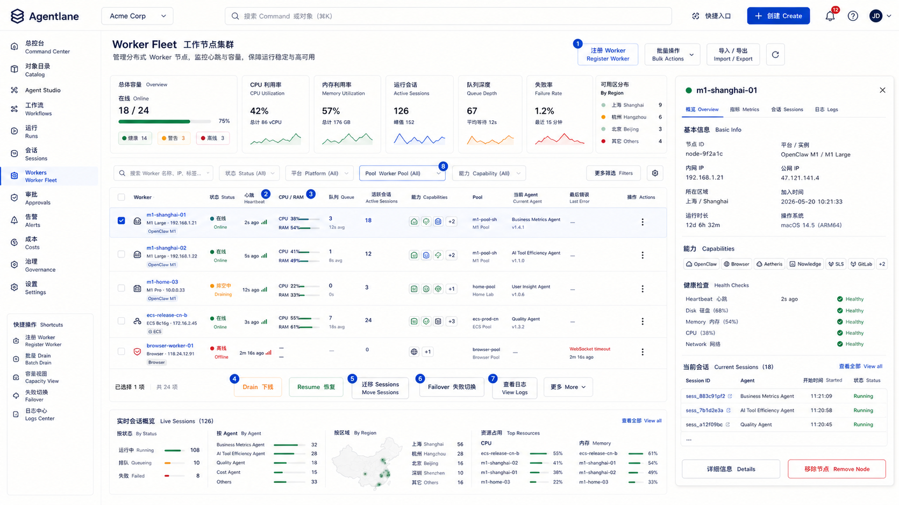

Purpose:
管理分布式执行设备，包括 M1、ECS、Browser Worker 和 OpenClaw Worker。它属于 Runtime / Execution Fabric，不负责语义编排。

Primary users:
平台管理员、OpenClaw 运维者、值班运营者。

Key interactions:

- 注册新 Worker，并选择 M1 / ECS / Browser Worker 类型。
- 查看 heartbeat、CPU/RAM、queue、active sessions、capabilities、pool 和 last error。
- 对 Worker 执行 Drain、Resume、Failover、View Logs。
- 查看当前 sessions，并迁移任务到其他 Worker。
- 按 Worker Pool、能力标签、健康状态筛选。
- 从 Worker 详情查看 OpenClaw、Nowledge、SLS、GitLab、Aetheris 等能力是否可用。

Data objects:
Worker、WorkerPool、WorkerCapability、Heartbeat、HealthCheck、Session、Task、Queue、FailoverEvent。

Entry points:
Command Center、Run Trace、Register Worker Flow、Governance 稳定性告警。

Exit points:
Run Trace、Skill Sync、Governance Center、Audit Log。

## 07. Runs / Run Trace

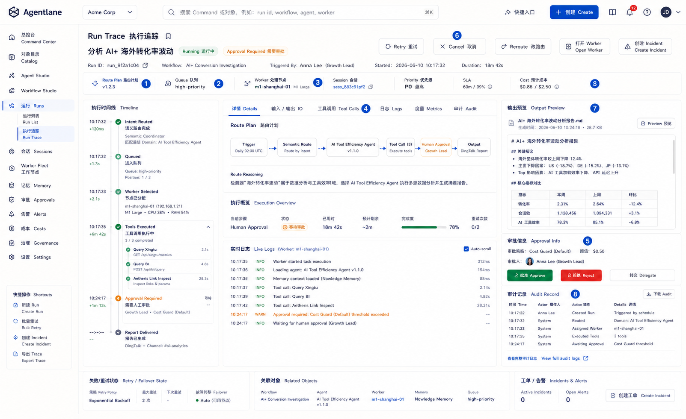

Purpose:
查看单次任务从入口、语义路由、排队、Worker 分配、工具调用、审批、产出到审计的完整链路。

Primary users:
运营者、Agent/Workflow owner、平台管理员、问题排查人员。

Key interactions:

- 查看 Route Plan，确认 Semantic Coordinator 为什么这样分配。
- 查看 Queue、Session Router 和 Worker Selection。
- 展开 Tool Calls、Skill Calls、Logs 和中间产物。
- 处理 Human Approval。
- 执行 Retry、Cancel、Reroute 或 Create Incident。
- 查看 Output Preview 和 Audit Record。
- 从失败节点跳转到 Worker Fleet、Skill 管理或 Governance。

Data objects:
Run、Task、RoutePlan、QueueItem、WorkerAssignment、ToolCall、SkillCall、LogEvent、Approval、Output、AuditRecord。

Entry points:
Command Center KPI、告警、Workflow Studio Dry Run、Run Execution Flow。

Exit points:
Worker Fleet、Skill 管理、Governance Center、Output、Decision Record。

## 08. People & Access

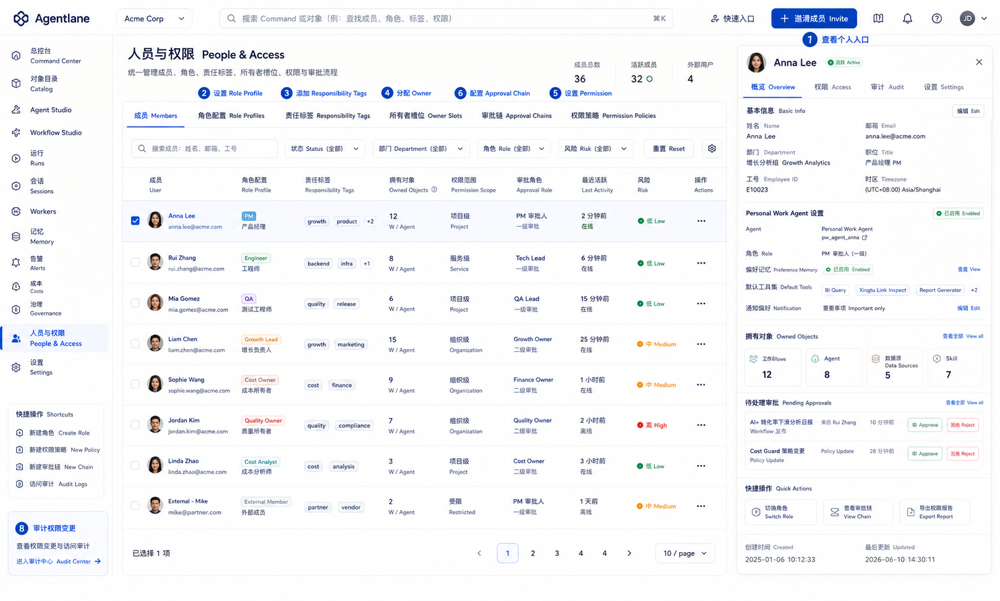

Purpose:
管理人、角色画像、责任标签、owner 槽位、权限范围和审批链。Personal Work Agent 是个人入口实例，不是职位 Agent。

Primary users:
平台管理员、团队负责人、治理负责人。

Key interactions:

- 邀请成员并设置 Role Profile。
- 添加 Responsibility Tags，例如 Cost Owner、Quality Owner、Metric Owner。
- 为 Agent、Workflow、Skill、Policy 分配 owner。
- 配置 Permission Scope 和 Approval Chain。
- 查看个人入口、偏好记忆和 owned objects。
- 审计权限变更和审批行为。

Data objects:
User、RoleProfile、ResponsibilityTag、OwnerSlot、PermissionPolicy、ApprovalChain、PersonalWorkAgent、PreferenceMemory。

Entry points:
Governance 缺失 owner 告警、Catalog 对象详情、Command Center 管理入口。

Exit points:
Governance Center、Agent Studio、Workflow Studio、Catalog。

## 09. Integrations & Resources

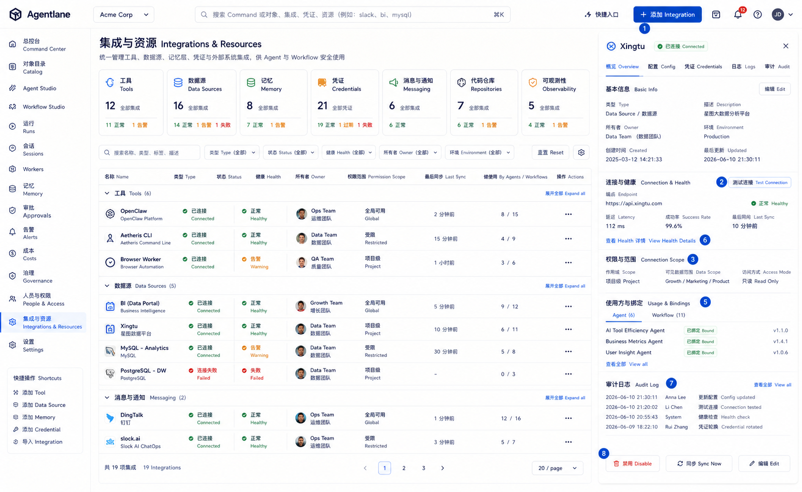

Purpose:
管理工具、数据源、记忆、凭证和外部系统，让 Agent、Workflow、Skill 不直接散落绑定底层资源。

Primary users:
平台管理员、资源 owner、Skill 维护者。

Key interactions:

- 添加 Integration，例如 OpenClaw、Nowledge、DingTalk、slock.ai、BI、Xingtu、SLS、GitLab、Aetheris CLI。
- 测试连接和健康检查。
- 设置 Credential Scope 和 Permission Scope。
- 配置 Memory 与 Data Source 的使用范围。
- 查看 Used by Agents / Workflows / Skills。
- 打开 Audit Log 或禁用风险资源。

Data objects:
Integration、Tool、DataSource、Memory、Credential、MessagingChannel、Repository、HealthCheck、PermissionScope。

Entry points:
Catalog、Agent Studio、Workflow Studio、Skill 管理、Governance 风险告警。

Exit points:
Governance Center、Run Trace、Catalog、People & Access。

## 10. Governance Center

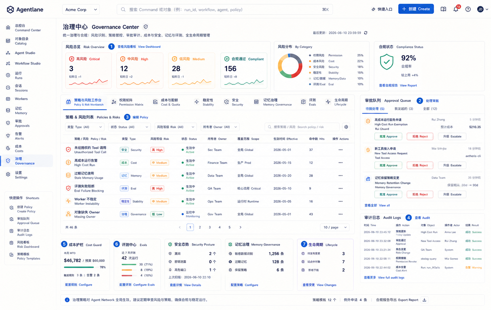

Purpose:
统一处理权限、审批、审计、成本、稳定性、安全、记忆治理、评测和生命周期策略。

Primary users:
治理负责人、平台管理员、值班运营者、业务 owner。

Key interactions:

- 查看风险摘要和 risk signals。
- 处理 approval queue，并支持 Approve、Reject、Escalate。
- 编辑 Permission Policy、Cost Guard、Memory Governance 和 Lifecycle Policy。
- 查看 Audit Logs 和 Policy Matrix。
- 设置 Eval 规则和稳定性规则。
- 对反复失败或低质输出触发升级、重跑、回滚或下线。

Data objects:
Policy、Approval、AuditLog、RiskSignal、CostGuard、SecurityRule、MemoryGovernanceRule、Eval、LifecycleTransition。

Entry points:
Command Center 告警、Run Trace 异常、Catalog 风险对象、Failure Recovery Flow。

Exit points:
Run Trace、People & Access、Worker Fleet、Catalog、Decision Record。

## 流程图

### 创建 Agent 流程 Create Agent Flow

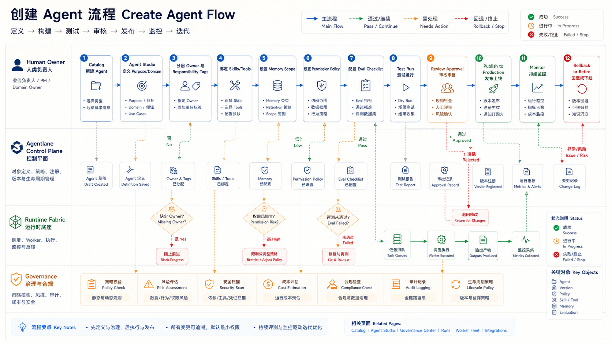

核心逻辑：

- 从 Catalog 新建 Agent，进入 Agent Studio。
- 先定义 Purpose、Domain 和 Output Contract，再分配 Owner 与 Responsibility Tags。
- 绑定 Skills、Tools、Memory Scope 和 Permission Policy。
- 配置 Eval Checklist 并执行 Test Run。
- 通过 Review Approval 后发布到 Production。
- 进入 Monitor 状态后，按风险和效果选择 Rollback、Retire 或 Replace。

关键风险点：
缺失 owner、权限风险、eval 失败、依赖 Skill 或 Tool 不健康。

### 创建 Workflow 流程 Create Workflow Flow

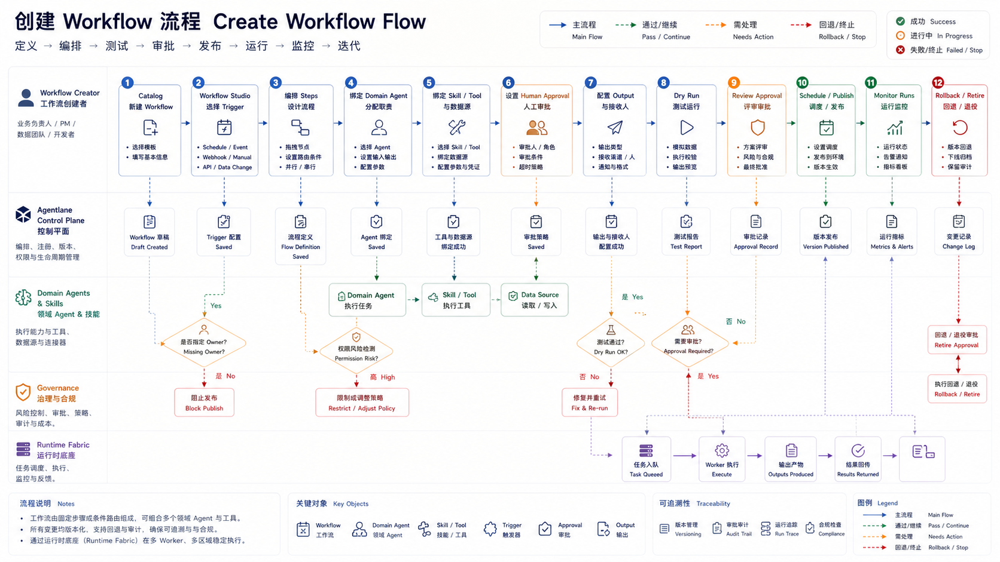

核心逻辑：

- 从 Catalog 新建 Workflow，进入 Workflow Studio。
- 选择 Trigger，编排 Steps，绑定 Domain Agent、Skill 和 Tool。
- 配置 Human Approval、Output、接收人、Schedule、Retry 和 Eval。
- 先 Dry Run，再进入 Review Approval。
- 通过后发布到 Pilot 或 Production。
- 运行后持续进入 Runs 和 Governance 监控。

关键风险点：
缺失 owner、审批链缺失、dry-run 失败、输出接收人不明确、权限过大。

### Skill 生命周期 Skill Lifecycle Flow

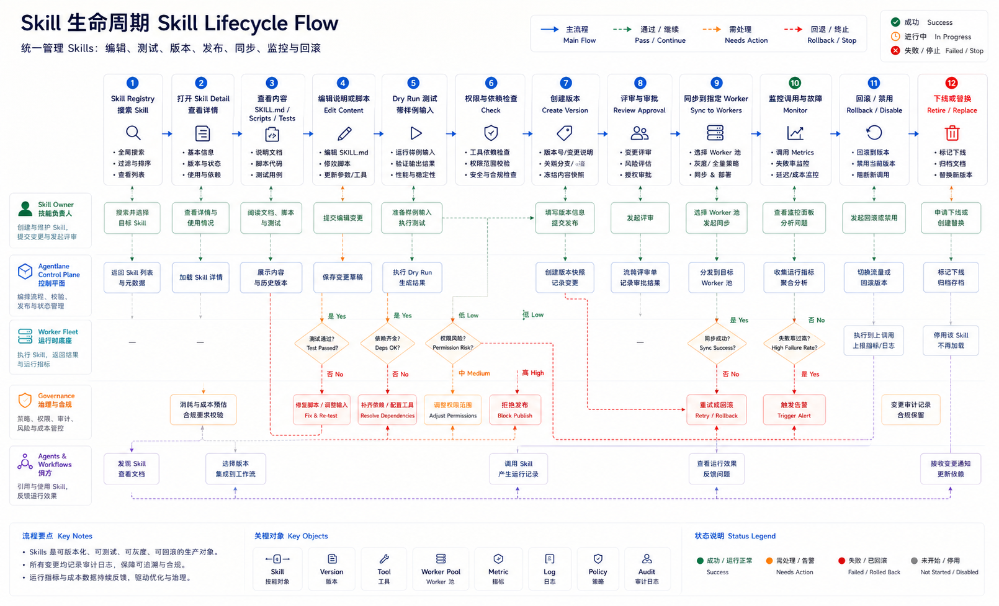

核心逻辑：

- 从 Skill 管理打开 Skill Detail。
- 查看 `SKILL.md`、文件树、Versions、校验结果和目标分配。
- 从 Markdown、GitHub URL 或 Marketplace URL 导入并通过包校验、依赖提示和权限检查。
- 发布最新版本；需要审核时创建 Approval Request。
- 审核通过后创建发布 Operation，并把版本标记为已发布。
- 选择 Device、Runtime 或 Agent 创建分配 Operation 或分配审核。
- 页面观察相关 Operation、Approval 和 Notification 状态，不展示没有 API 与 harness 的编辑、归档、删除或手动同步入口。

关键风险点：
包校验阻断、依赖缺失、权限风险、目标不支持、同步失败、通知重复发送。

### 注册 Worker 流程 Register Worker Flow

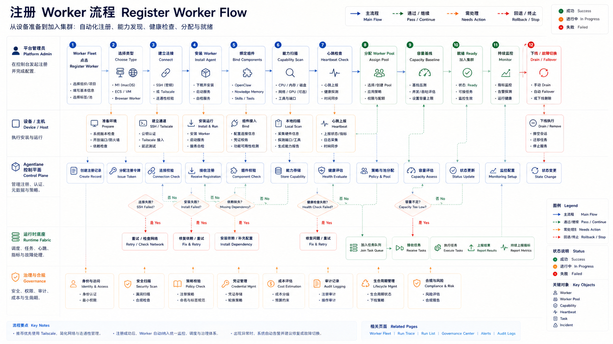

核心逻辑：

- 在 Worker Fleet 点击 Register Worker。
- 选择 M1、ECS 或 Browser Worker 类型。
- 建立 SSH 或 Tailscale 连接。
- 安装 Lorume Worker，并绑定 OpenClaw、Nowledge 和 Skills。
- 执行 Capability Scan 和 Heartbeat Check。
- 分配 Worker Pool，建立 Capacity Baseline。
- Ready 后进入持续监控。
- 不健康时执行 Drain、Failover 或下线。

关键风险点：
SSH 失败、依赖缺失、健康检查失败、容量不足、OpenClaw/Nowledge 不可用。

### 运行执行流程 Run Execution Flow

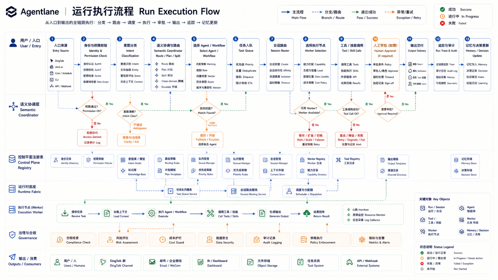

核心逻辑：

- 任务从 DingTalk、slock.ai、Cron、CLI 或 API 进入。
- 先进行 Identity & Permission Check。
- Intent Classification 后交给 Semantic Coordinator 做 Route、Plan 和 Split。
- 选择 Agent 或 Workflow，再进入 Task Queue。
- Session Router 选择合适 Worker。
- Worker 执行 Tool / Skill Calls。
- 如需要，触发 Human Approval。
- 交付 Brief、Report、Alert、Task、Decision 或 Follow-up。
- 写入 Run Trace、Audit Record、Memory 和 Decision Record。

关键风险点：
权限拒绝、路由不明确、Worker 不可用、审批超时、Tool/Skill 调用失败。

### 故障恢复流程 Failure Recovery Flow

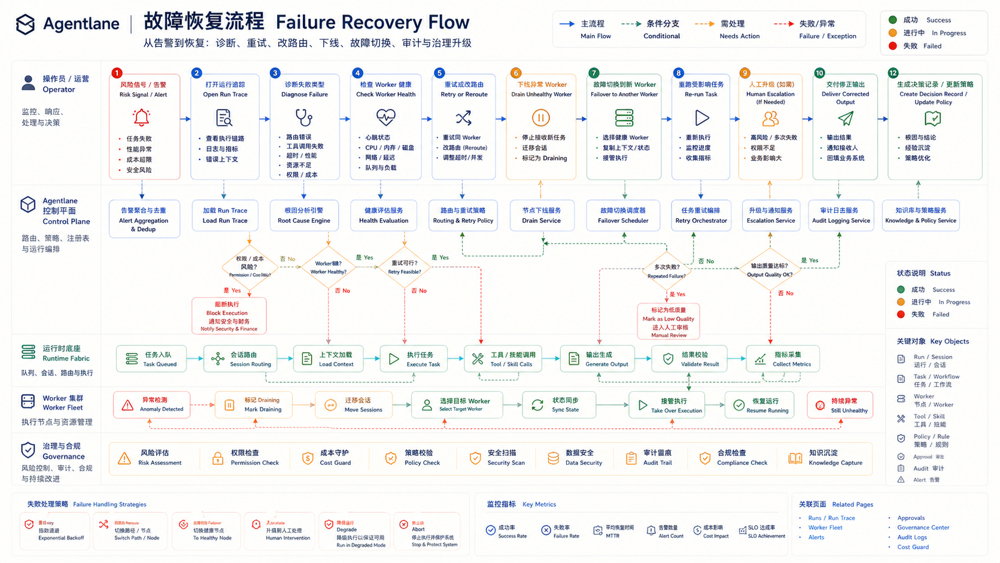

核心逻辑：

- Risk Signal 或 Alert 触发排查。
- 从 Governance 或 Command Center 打开 Run Trace。
- 判断失败类型：权限、Worker、Tool/Skill、低质输出、成本或稳定性。
- 查看 Worker Health，决定 Retry、Reroute 或 Drain。
- Worker 不健康时 Failover 到其他 Worker。
- 重跑受影响任务并交付修正输出。
- 必要时 Human Escalation。
- 写入 Audit Record，并沉淀 Decision Record 或更新 Policy。

关键风险点：
重复失败、权限风险、Worker 不健康、输出质量低、Cost Guard 触发。

## 实现优先级

- Console 只暴露已经有页面、数据链路、权限规则和 harness 的能力。
- 已实现页面是 Runtime Fleet、Skill 管理、Runs / Work Board、任务中心、通知中心和组织设置。
- Object Catalog、Agent 迁移、Agent Studio、Workflow Studio、Governance Center、Integrations & Resources 等页面进入实现前，必须先补齐对应 spec、对象模型、权限边界和 harness。
- Integrations & Resources 接入 OpenClaw、Multica、Slock、Codex、DingTalk、Telegram、Slack、BI、星图、SLS、GitLab、Aetheris CLI 等资源时，平台差异必须由 adapter 转换为 Lorume 语义。
- 图片中的 UI 细节不应被机械照搬，真正实现时应以对象模型、交互流和运行态数据为准。
